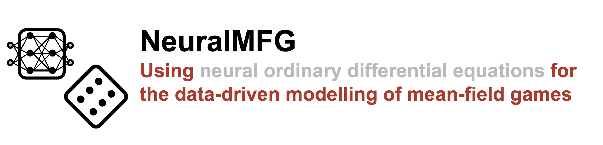

## 💡 About
This repository contains four implementations of mean-field games (MFGs). The code is written in Python and all games are compatible with [JAX](https://jax.readthedocs.io/en/latest/), connecting them to the JAX ecosystem. While all games can be solved using the MFG theory, this repository offers the possibility to add a neural network to the systems of differential equations describing the games. 


The system of differential equations, including the contributions of the neural network, can be solved to analyze the equilibria of the game. The differential equations are solved via discretization using [Diffrax](https://docs.kidger.site/diffrax/). 

### 🎲 Games included 

* [`El Farol Bar Problem`](https://github.com/KachmanLab/MFGSandbox/tree/main/games/el_farol)
* [`Liar's Dice`](https://github.com/KachmanLab/MFGSandbox/tree/main/games/liars_dice)
* [`Meeting Arrival Times`](https://github.com/KachmanLab/MFGSandbox/tree/main/games/meeting_arrival_times)

## ⚙️ Installation
To get started, it's recommended to create a clean python environment and install the required packages listed in [`requirements.txt`](https://github.com/KachmanLab/MFGSandbox/tree/main/requirements.txt), for example using:

```shell
(your virtualenv) C:\path\to\MFGSandbox> pip install -r requirements.txt
```

To test your installation, you can run the tests as described in [☑️ Tests](#-tests).

## 🐎 Quickstart: When does the meeting start?
The main purpose of this repository is providing examples of mean-field games such as the *meeting arrival times* game. This game is introduced in the book ``Mean Field Games and Applications" by Olivier Guéant, Jean-Michel Lasry and Pierre-Louis Lions. You can find and in-depth explanation in `meeting_arrival_times/setup.md`, but for this example it suffices to know that a distribution of agents tries to optimize their arrival times for a shared meeting that starts if `threshold`% of the agents have arrived.

In this simple example, we show how to initialize the game as a system of stochastic differential equations (SDE). We solve the SDE using Diffrax, ending up in some form of equilibrium.

```python
# imports
import numpy as np

import jax.random as jrandom
from diffrax import diffeqsolve, Euler, MultiTerm, SaveAt

from games.meeting_arrival_times.MeetingTime import MeetingTime
from diffrax import ControlTerm, ODETerm, VirtualBrownianTree

N = 6  # Number of distributions to sample from
M = 7  # Number of samples per distribution

mu = 12  # The official starting time of the meeting
sigma = 0.5  # Starting time noise (perhaps due to incomplete communication)

k = 2  # Noise parameters
theta = 0.2

# Set the minimal number of agents required for the meeting to start
threshold = 0.8

# Generate initial distribution
initial_distribution = np.random.normal(mu, sigma, size=N * M)

# Initialize meeting, defined as a stochastic differential equation (SDE)
t0 = 1
t1 = 15
meeting = MeetingTime(mu, threshold)
brownian_motion = VirtualBrownianTree(t0, t1, tol=1e-3, shape=(), key=jrandom.PRNGKey(0))
terms = MultiTerm(ODETerm(meeting.drift), ControlTerm(meeting.diffusion, brownian_motion))

# Play the game by solving the SDE
solver = Euler()
save_range = np.arange(t0, t1, 1)
saveat = SaveAt(ts=save_range)
sol = diffeqsolve(terms, solver, t0, t1, dt0=0.05, y0=initial_distribution, saveat=saveat)
```

A more elaborate analysis of this game and its outcome is provided in [`getting_started.ipynb`](https://github.com/KachmanLab/MFGSandbox/tree/main/getting_started.ipynb). This notebook also contains code for adding a neural ODE to the game, which is then trained towards a target distribution of arrival times. 

## 📚 Documentation
The setup, rules and goals of each game are documented in the appropriate `README.md` files in the respective game folders. 

## ♻️ Reproducibility
To reproduce the results from the paper _Modelling Mean-Field Games with Neural Ordinary Differential Equations_, you can run the following entry points:

| **Figure** | **Analysis**                                                                                                                                                      | **Plots**                                                                                                                                                   |
|:----------:|-------------------------------------------------------------------------------------------------------------------------------------------------------------------|-------------------------------------------------------------------------------------------------------------------------------------------------------------|
|     2a     | [`games/meeting_arrival_times/arrival_times_example.py`](https://github.com/KachmanLab/MFGSandbox/tree/main/games/meeting_arrival_times/arrival_times_example.py) | " "                                                                                                                                                         | 
|     2b     | [`games/meeting_arrival_times/arrival_times_nODE.py`](https://github.com/KachmanLab/MFGSandbox/tree/main/games/meeting_arrival_times/arrival_times_nODE.py)       | " "                                                                                                                                                         | 
|     3a     | [`games/el_farol/bar_example.py`](https://github.com/KachmanLab/MFGSandbox/tree/main/games/el_farol/bar_example.py)                                               | " "                                                                                                                                                         |
|     3b     | [`games/el_farol/bar_nODE.py`](https://github.com/KachmanLab/MFGSandbox/tree/main/games/el_farol/bar_nODE.py)                                                     | " "                                                                                                                                                         |
|     4      | [`games/liars_dice/analyses/game_analyses.py`](https://github.com/KachmanLab/MFGSandbox/tree/main/games/liars_dice/analyses/game_analyses.py)                     | [`games/liars_dice/analyses/plot_game_analyses.py`](https://github.com/KachmanLab/MFGSandbox/tree/main/games/liars_dice/analyses/plot_game_analyses.py)     |
|     5      | [`games/liars_dice/analyses/game_analyses.py`](https://github.com/KachmanLab/MFGSandbox/tree/main/games/liars_dice/analyses/game_analyses.py)                     | [`games/liars_dice/analyses/plot_game_analyses.py`](https://github.com/KachmanLab/MFGSandbox/tree/main/games/liars_dice/analyses/plot_game_analyses.py)     |
|     6      | [`games/liars_dice/analyses/data_efficiency.py`](https://github.com/KachmanLab/MFGSandbox/tree/main/games/liars_dice/analyses/data_efficiency.py)                 | [`games/liars_dice/analyses/plot_data_efficiency.py`](https://github.com/KachmanLab/MFGSandbox/tree/main/games/liars_dice/analyses/plot_data_efficiency.py) |


## ☑️ Tests
The framework is tested with `pytest`. Each game has separate tests, located in the `games/[game]/tests/` folder. All tests can be run simultaneously by running 

````shell
(your virtualenv) C:\path\to\MFGSandbox> pytest .
````

in the project root. 